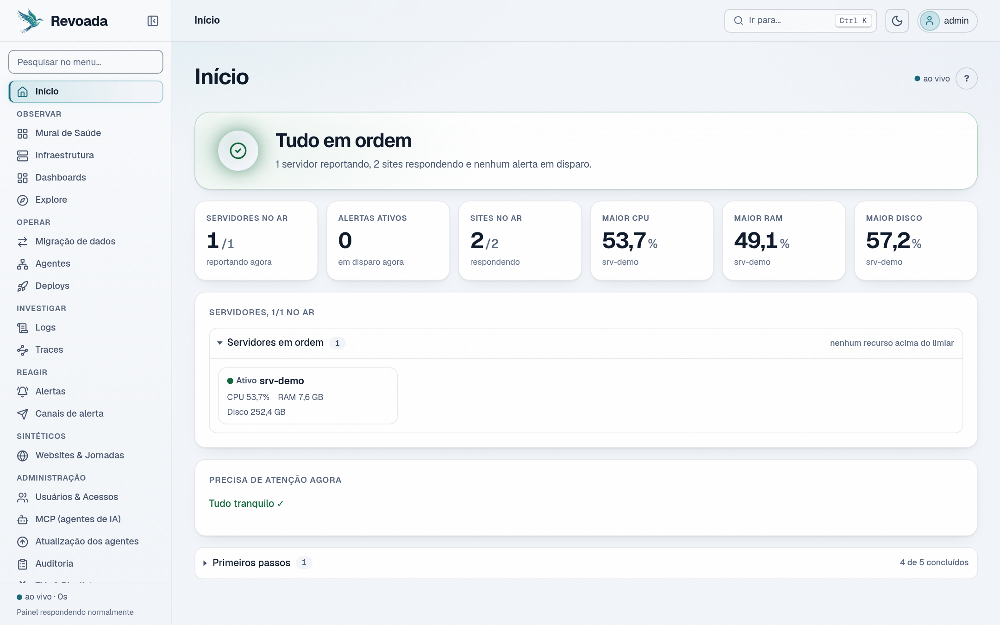
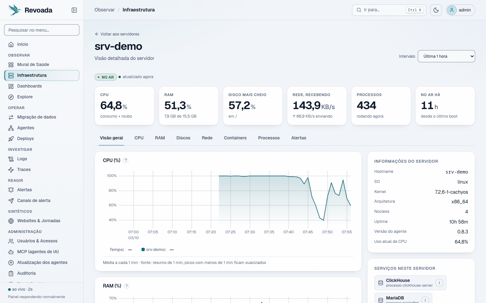
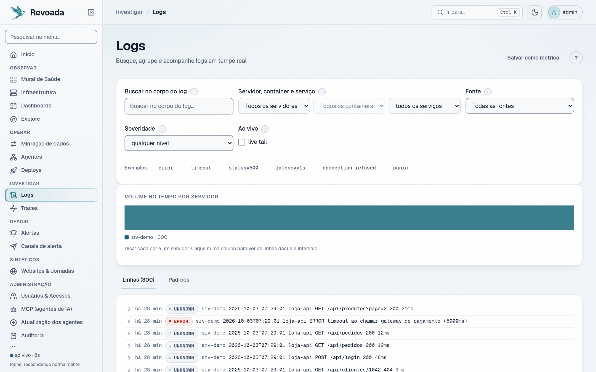
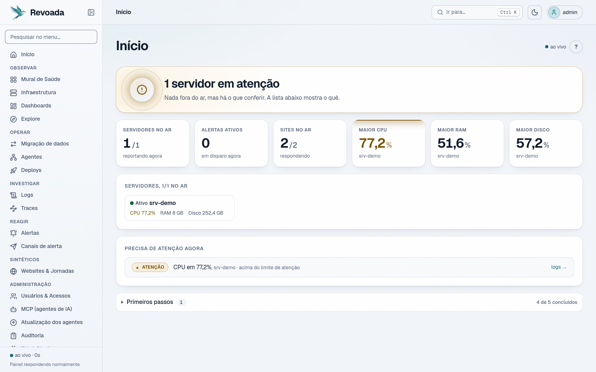
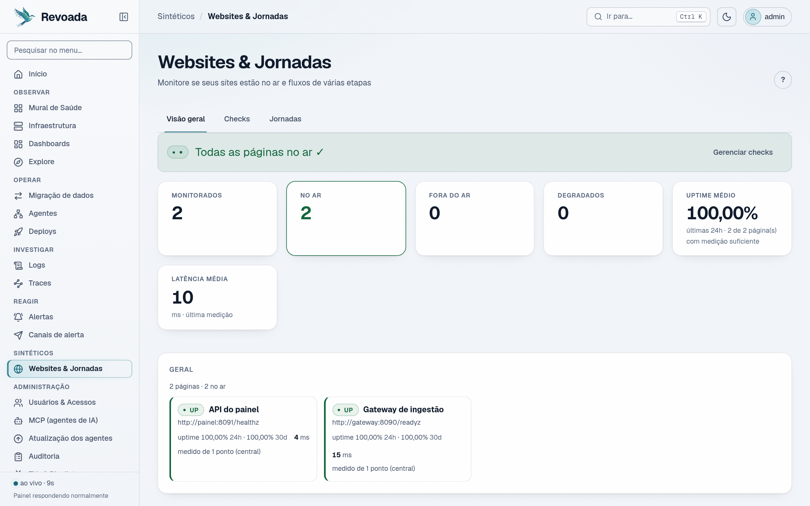
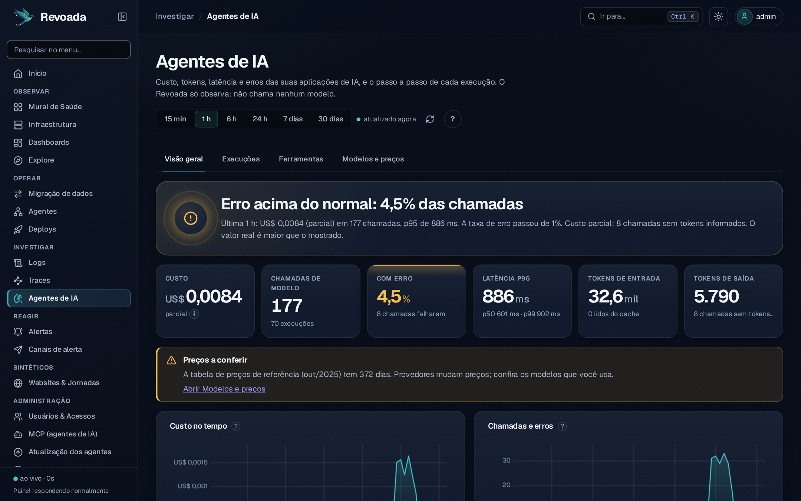
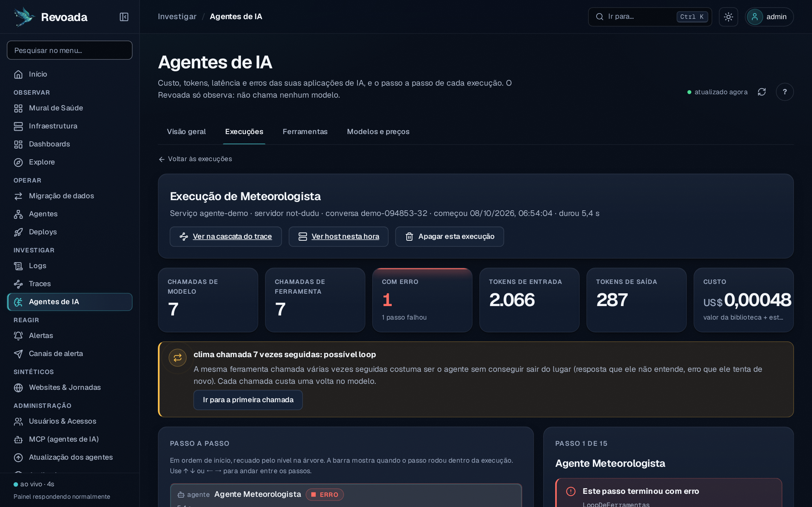
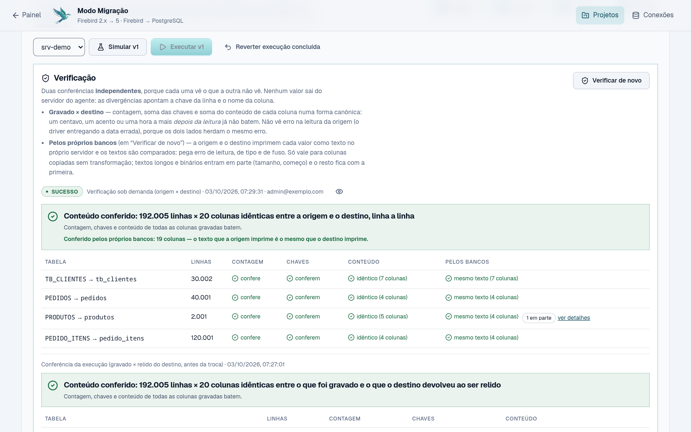
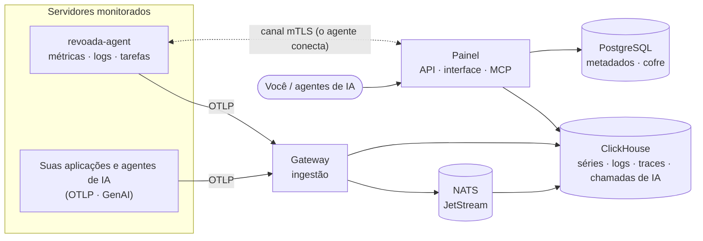

<div align="center">


# Revoada

**Monitoramento de servidores e migração de bancos de dados, no seu servidor.**
Métricas, logs, alertas, checagem de sites e uma migração Firebird → PostgreSQL que prova,
linha a linha, que nada se perdeu no caminho.

[](https://github.com/eduardorarruda/revoada/actions/workflows/ci.yml)
[](LICENSE)
[](https://go.dev)
[](web)
[](#-início-rápido)

[Início rápido](#-início-rápido) ·
[Recursos](#-o-que-ele-faz) ·
[Migração verificada](#-migração-que-se-prova-certa) ·
[Arquitetura](#-arquitetura) ·
[Contribuir](CONTRIBUTING.md)



</div>

---

## ✨ Por que o Revoada

- **Tudo num lugar só.** CPU, RAM, disco, rede, containers, logs, traces, checagem de sites e
  jornadas, alertas no WhatsApp/e-mail/Telegram e status page — sem montar cinco ferramentas.
- **A resposta antes do gráfico.** A tela inicial diz em uma frase se está tudo bem — e nunca
  afirma o que não mediu: servidor mudo, métrica velha ou fonte que falhou aparecem como tal.
- **Migração de banco com prova.** Simulação obrigatória, execução em lotes com checkpoint,
  troca atômica, reversão em uma transação e **verificação em três camadas independentes**.
- **Agentes de IA ao lado da infraestrutura.** Custo, tokens, latência, erros e o replay
  passo a passo de cada execução, a partir do OpenTelemetry que a aplicação já emite — e, na
  mesma tela, a CPU e os logs do servidor onde o agente rodou.
- **Seu servidor, seus dados.** Self-hosted, um `docker compose up`. O agente abre a conexão
  (mTLS) — o servidor monitorado não expõe porta nenhuma.
- **Seguro por padrão.** MFA obrigatório para quem administra, cofre de credenciais em
  envelope, tarefas assinadas, auditoria encadeada e redação de segredos nos logs.

## 🚀 Início rápido

Você precisa de **Docker** com o plugin **Compose v2**.

```bash
git clone https://github.com/eduardorarruda/revoada.git
cd revoada
./scripts/iniciar.sh
```

O script gera um `.env` com segredos aleatórios, compila as imagens e sobe tudo. Abra
**http://localhost:8080** e crie o administrador no primeiro acesso (com 2FA).

| Serviço | Porta | Para quê |
|---|---|---|
| Painel | `8080` | Interface, API e MCP |
| Gateway | `8090` (HTTP) · `4317` (gRPC) | Recebe métricas, logs e traces (OTLP) |
| Canal dos agentes | `7443` | Conexão mTLS iniciada pelo agente (tarefas de migração, deploy) |

> Em produção, coloque um proxy com HTTPS na frente do painel (Caddy, Traefik ou nginx),
> ajuste os endereços públicos no `.env` e ligue `REVOADA_SECURE_COOKIES=1`.
> Todas as opções estão comentadas em [`.env.example`](.env.example).

### Monitorar um servidor

1. Baixe o `revoada-agent` da [página de releases](https://github.com/eduardorarruda/revoada/releases)
   (Linux, Windows e macOS, amd64/arm64) — ou compile: `cd agent && go build ./cmd/revoada-agent`.
2. No painel, **Infraestrutura → Adicionar servidor** gera a chave de ingestão. Coloque-a no
   [`agent.yaml`](agent/config.example.yaml) junto com o endereço do gateway.
3. Instale como serviço do sistema (systemd, launchd ou Serviço do Windows):

```bash
sudo ./revoada-agent -config /etc/revoada/agent.yaml servico instalar
sudo ./revoada-agent -config /etc/revoada/agent.yaml servico iniciar
```

Para as tarefas de migração e deploy, inscreva o agente no canal: **Agentes → Inscrever
servidor** mostra o comando `revoada-agent inscrever` com um token de uso único. Hospedagem
sem systemd (cPanel)? Veja [docs/agente-cpanel.md](docs/agente-cpanel.md).

## 🧭 O que ele faz

<table>
<tr>
<td width="50%" valign="top">

**Observar**
- Métricas do host e de containers Docker, por montagem e por interface
- Dashboards versionados, tempo real por WebSocket, Explore sem escrever consulta
- Mural de Saúde com semáforo por servidor e modo TV/kiosk

**Investigar**
- Logs com busca, histograma, padrões, contexto e *live tail*
- Traces OTLP com *waterfall*, mapa de serviços e correlação métrica → trace → log
- **Agentes de IA**: custo, tokens, erros e o replay passo a passo de cada execução, a partir do OpenTelemetry que a aplicação já emite
- Redação de segredos na origem: senha, token, JWT, URL com senha, cartão de crédito

</td>
<td width="50%" valign="top">

**Reagir**
- Alertas com prévia retroativa, silêncios, plantão, escalonamento e detecção de oscilação
- Notificações por WhatsApp, e-mail, webhook e Telegram
- Checagem de sites (DNS → TLS → TTFB), jornadas de vários passos e status page pública

**Operar**
- Migração Firebird/PostgreSQL → PostgreSQL com verificação em três camadas
- Upgrade Firebird 2.x → 5 com diagnóstico, ensaio e `fix.sql` — o original nunca é alterado
- Deploy pelo agente a partir de uma GitHub Action, com health check e reversão automática
- Servidor **MCP** para agentes de IA, com tokens de escopo e auditoria

</td>
</tr>
</table>

<p align="center">
  
  
</p>
<p align="center">
  
  
</p>

## 🤖 Agentes de IA

Se a sua aplicação chama LLM — chatbot, agente com ferramentas, RAG —, mande os traces
OpenTelemetry dela para o gateway. O Revoada entende a convenção GenAI do OpenTelemetry, o
OpenLLMetry, o OpenInference e o Vercel AI SDK (testado contra spans gravados de cada
biblioteca) e responde, ao lado da CPU e dos logs do mesmo servidor:

- **Quanto custa** — custo por modelo, agente e execução, estimado por uma tabela de preços
  com vigência (troca de preço não reescreve o passado) ou o informado pela biblioteca;
  modelo sem preço aparece como "sem preço", nunca como zero.
- **Onde falha e quanto demora** — erros por modelo e por ferramenta, p50/p95/p99.
- **O que o agente fez** — replay de cada execução, passo a passo, com o loop de ferramenta
  apontado e, se você ligar, a conversa com segredos e cartões redigidos.
- **Quando avisar** — séries `llm.*` nos alertas comuns: gasto por hora, erros, latência,
  agente em loop, modelo sem preço (modelos prontos na tela de Alertas). E as mesmas
  respostas pelo MCP.

<p align="center">
  
  
</p>

Prompt e resposta ficam **desligados** por padrão (`REVOADA_GENAI_CONTEUDO`); ler ou apagar
conversas pede 2FA e confirmação de identidade, e cada leitura entra na auditoria. O
Revoada observa IA, mas não usa: nada nele chama um modelo
([ADR 008](docs/adr/008-observar-agentes-de-ia.md)).

Guia por biblioteca (Python, Node.js, Go): [docs/instrumentacao-ia.md](docs/instrumentacao-ia.md) ·
API: [docs/api-ia.md](docs/api-ia.md) · para ver a tela sem chave de API:
[exemplos/agente-demo](exemplos/agente-demo).

## 🛡️ Migração que se prova certa

Migrar o banco de um cliente só é seguro se der para **provar** que o destino ficou igual à
origem. O Revoada não pede que você confie — ele mostra:

| Passo | O que é garantido |
|---|---|
| **Conexões** | Senha cifrada no cofre, selada para um agente específico; o painel nunca vê dado das tabelas |
| **Estrutura** | O agente lê só o schema (tabelas, tipos, chaves, FKs) dos dois bancos |
| **Mapeamento** | Versionado; só versão sem erro é aprovada; coluna obrigatória sem origem bloqueia |
| **Simulação** | Lê 100% da origem e aplica as transformações sem gravar nada; aponta cada linha que o destino recusaria |
| **Execução** | Lotes com checkpoint na mesma transação (pausa e retoma), staging e troca atômica no fim |
| **Verificação** | Três camadas: soma canônica de cada coluna antes da troca · comparação linha a linha · **os próprios bancos imprimem cada valor como texto e os textos são comparados** |

A terceira camada não passa pela conversão de tipos do Revoada — é ela que pega erro de
leitura, de tipo e de fuso horário. Num ERP de teste com 192 mil linhas, todas as camadas
fecharam em **192.005 linhas × 20 colunas idênticas**. Reverter desfaz tudo em uma transação.

<p align="center">
  
</p>

## 🏗️ Arquitetura



| Pasta | Papel |
|---|---|
| [`server/`](server) | Painel: API, autenticação, alertas, migração, MCP e a interface embutida (binário único) |
| [`gateway/`](gateway) | Ingestão OTLP (HTTP e gRPC), reconhecimento das chamadas de IA, scrape Prometheus, descoberta e sondas |
| [`agent/`](agent) | Agente em Go: coleta, buffer em disco, canal mTLS, migração, upgrade Firebird, deploy |
| [`web/`](web) | Interface React + Vite + TypeScript |
| [`core/`](core) | Regras puras compartilhadas: cofre, selo, schema, mapeamento, transformações, plano, normalização de spans de IA (`genai`), redação de segredos |
| [`proto/`](proto) | Contrato gRPC painel ↔ agente |
| [`desktop/`](desktop) | App desktop (Wails) |
| [`acoes/`](acoes) | GitHub Action [`revoada-deploy-action`](acoes/revoada-deploy-action) |
| [`deploy/`](deploy) | Compose de desenvolvimento, migrações do ClickHouse, instaladores do agente, backup |
| [`tests/validacao/`](tests/validacao) | Bateria que confere o stack rodando contra o kernel da máquina e contra o que foi enviado |
| [`exemplos/agente-demo/`](exemplos/agente-demo) | Agente de IA de demonstração, com LLM falso local |

Mais detalhes em [docs/ARQUITETURA.md](docs/ARQUITETURA.md) e
[docs/SEGURANCA.md](docs/SEGURANCA.md).

## ✅ Como sabemos que funciona

Além dos testes de unidade e de integração (Firebird 2.5, Firebird 5 e PostgreSQL de verdade,
em UTC e no fuso de São Paulo), a [bateria de validação](tests/validacao) compara o que a tela
mostra com o que a máquina mede: RAM contra `/proc/meminfo`, CPU contra `/proc/stat` sob carga
conhecida, disco contra `statvfs`, cada linha de log marcada, e cada checagem de site contra o
log de um servidor de teste que registra exatamente o que recebeu. Para os agentes de IA, ela
envia spans com tokens, erros e ferramentas conhecidos e confere cada número da tela: custo
exato (inclusive com troca de preço no meio do período), permissões com usuários reais, MCP
por HTTP, isenção de amostragem e o apagamento de dados. Resultado atual: **152 de 152**
verificações de servidor, logs e sites, e **60 de 60** de agentes de IA.

## 🧑‍💻 Desenvolvimento

```bash
make dev-up      # PostgreSQL, ClickHouse, NATS e Redis
make migrate     # tabelas de telemetria
make test        # testes Go
cd web && npm install && npm run dev   # interface em :5173
```

O passo a passo completo está em [CONTRIBUTING.md](CONTRIBUTING.md).

## 🤝 Contribuindo

Issues e pull requests são bem-vindos — leia o [guia de contribuição](CONTRIBUTING.md) e o
[código de conduta](CODE_OF_CONDUCT.md). Vulnerabilidades: [SECURITY.md](SECURITY.md).

## 📄 Licença

[AGPL-3.0](LICENSE). Use, estude, modifique e distribua à vontade; se oferecer uma versão
modificada como serviço, compartilhe as modificações com quem usa.

<details>
<summary><b>English summary</b></summary>

Revoada is a self-hosted, open-source platform for **server monitoring** (metrics, logs,
traces, uptime checks, alerting, status pages) and **database migration** (Firebird/PostgreSQL
→ PostgreSQL, Firebird 2.x → 5 upgrades) whose migrations are verified in three independent
layers — including having both databases render every value as text and comparing them.
It also observes **AI agents** from their OpenTelemetry traces (GenAI semantic conventions, Vercel AI SDK,
OpenLLMetry, OpenInference): cost, tokens, errors and a step-by-step replay — without
calling any model itself.
Start it with `./scripts/iniciar.sh` (Docker Compose) and open `http://localhost:8080`.
The codebase and UI are in Brazilian Portuguese. Licensed under AGPL-3.0.

</details>
