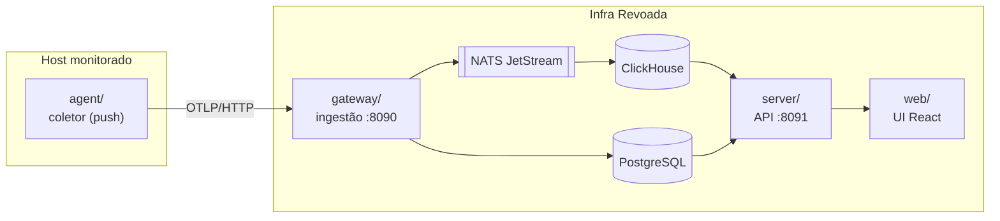

# Guia de manutenção — Revoada

## 1. Antes de tudo: uma conversa honesta sobre a stack

Este projeto **não é PHP**. A stack é:

- **Go** (backend: agente, gateway, server) — três módulos num monorepo `go.work`.
- **React 19 + Vite + TypeScript** (frontend em `web/`).
- **ClickHouse** (métricas, logs, spans), **PostgreSQL** (metadados) e
  **NATS JetStream** (fila de ingestão). Redis entra no stack de dev.

Vale separar o que é **decisão de time** do que este documento cobre:

| Isso é decisão de time (não some com um doc) | Isso o documento resolve |
|---|---|
| Aprender Go. Não dá para eliminar — é a linguagem do backend. | Orientação prática para as tarefas do dia a dia. |
| A boa notícia: para quem **já programa**, a curva é curta. Go é pequeno, tem uma sintaxe só, tooling embutido (`go build`, `go test`, `go fmt`) e sem mágica de framework. | Onde rodar, onde depurar, **onde mexer** para cada tarefa comum, e um glossário para destravar o vocabulário. |

Ou seja: a "barreira do não-PHP" é real, mas é uma barreira de **familiaridade**, não
de complexidade. Quem entende requisição/resposta, banco e fila já tem tudo para
manter este sistema.

## 2. Arquitetura em uma olhada



### Fronteiras — o que cada módulo faz e NÃO faz

| Módulo | Faz | Não faz |
|---|---|---|
| **`agent/`** | Roda **no host monitorado**. Coleta métricas locais (gopsutil), logs opt-in e sondas de site; envia (push) ao gateway. | Não expõe API, não abre porta de entrada, não fala com banco. |
| **`gateway/`** | Ingestão OTLP. Recebe do agente, enfileira no NATS, grava metadados no Postgres (`agents`, `hosts`). | Não serve UI, não faz auth de usuário, não responde consultas de dashboard. |
| **`server/`** | API de negócio: auth, dashboards, alertas, notificações, query, inventário, incidentes, logs, sondas. | Não recebe dados do agente (isso é o gateway). |
| **`web/`** | UI em React (pt-BR, hash routing, tokens de design `--ok`/`--warn`/`--crit`). Consome a API do server. | Não fala direto com ClickHouse/Postgres. |

## 3. Rodar e depurar localmente

Pré-requisitos: Docker + Docker Compose, Go 1.25+, `python3` e `curl`
(o runbook completo está em [`docs/runbook-dev.md`](runbook-dev.md)).

```bash
# 1. Subir o stack de dados (ClickHouse 8123/9000, Postgres 5433->5432,
#    Redis 6379, NATS 4222/8222)
make dev-up
docker compose -f deploy/docker-compose.dev.yml ps   # tudo healthy

# 2. Aplicar o schema do ClickHouse (idempotente)
make migrate

# 3. Subir o gateway (:8090)
cd gateway && go run ./cmd/gateway
curl -s localhost:8090/readyz    # {"ready":true,...}

# 4. Subir o server (:8091)
cd server && go run ./cmd/server

# 5. Subir a UI
cd web && npm run dev
```

### Ver os dados

```bash
# Métricas no ClickHouse
docker exec revoada-clickhouse clickhouse-client --user revoada --password ##### \
  --query "SELECT metric, count() FROM revoada.metrics GROUP BY metric ORDER BY metric"

# Metadados no Postgres
docker exec revoada-postgres psql -U revoada -d revoada -c "SELECT * FROM hosts;"
```

### Onde ficam os logs

Cada processo Go loga em **stdout/stderr** (formato estruturado via `slog`) — quem
sobe o processo (terminal em dev, systemd/journald em produção) recebe os logs. Os
containers de dados logam pelo Docker (`docker logs revoada-clickhouse`, etc.).

## 4. Onde mexer para tarefas comuns

| Tarefa | Onde mexer |
|---|---|
| **Adicionar uma métrica de host nova** | `agent/internal/collect/host.go` — acrescente um ponto na função `Host(...)` (padrão `add("system.algo.utilization", valor)`); as métricas fluem sozinhas pelo OTLP. |
| **Novo tipo de painel** | `web/src/panels/` (o componente) + registro em `web/src/.../DashboardView.tsx`. Os tipos válidos hoje estão em [`docs/dashboard-schema.md`](dashboard-schema.md) (`timeseries`, `stat`, `gauge`, `bargauge`, `table`, `state-timeline`, `heatmap`, `text`). |
| **Novo canal de alerta** | `server/internal/notify/senders.go` — implemente a interface `Sender` e registre no mapa `senders`. Espelhe o `whatsappSender` (Evolution API): monta a URL a partir de `base_url`/`instance`, autentica no header `apikey`, envia `{number, text}` por destinatário e junta as falhas. Cada sender usa `http.Client{Timeout: defaultSendTimeout}` (15s). |
| **Nova rota HTTP** | `server/internal/httpapi/httpapi.go` — registre no `mux` com o wrapper de permissão certo: `protected` (autenticado), `editor` (editor+) ou `admin`. Ex.: `mux.Handle("GET /api/minha-rota", protected(d.MeuHandler))`. |
| **Mudar retenção de métricas/logs** | `deploy/migrations/clickhouse/*.up.sql` — cláusula `TTL`. Hoje: `metrics` 7 dias (001), `metrics_1m` 90 dias (002), `metrics_1h` 730 dias (003), `events` 90 dias (005), `logs` 30 dias (007), `spans` 15 dias (008). Crie uma migração nova; não edite as já aplicadas. |
| **Novo coletor de log de servidor** | `agent/internal/logtail/` — há um arquivo por fonte (`journald.go`, `dockerlogs.go`, `syslog.go`, `kmsg.go`) sobre a base comum (`record.go`, `logtail.go`, `supervise.go`). O `record.go` já dá o padrão de lote: flush por tamanho (**200** registros) ou tempo (**2s**), NDJSON para `/ingest/logs`. Ligue o coletor por toggle na config e no `main.go`. |

## 5. Glossário

| Termo | O que é |
|---|---|
| **OTLP** | *OpenTelemetry Protocol.* Formato/protocolo padrão de telemetria que o agente usa para enviar métricas ao gateway (via HTTP). |
| **ClickHouse** | Banco colunar orientado a séries temporais. Guarda métricas, logs e spans; ótimo para agregação sobre muitos dados. |
| **Materialized view / rollup** | *View* que grava resultados pré-agregados numa tabela ao vivo. Aqui, `metrics_1m` e `metrics_1h` fazem *downsampling* (por minuto e por hora) da tabela bruta `metrics`, via `AggregatingMergeTree` — a consulta escolhe a tabela pela janela de tempo. |
| **NATS JetStream** | Sistema de mensageria com persistência. É a fila de ingestão: o gateway publica, o consumidor grava no ClickHouse. Absorve picos e desacopla ingestão de gravação. |
| **WAL** | *Write-Ahead Log.* Buffer em disco no agente (`agent/internal/buffer/`); guarda os lotes quando o gateway está fora e reenvia depois. Teto default 5000 arquivos, descarta o mais antigo. |
| **serverkey** | Chave de ingestão de um agente (tabela `agents`). Viaja no header `X-Revoada-Key`; é como o gateway sabe de quem é o dado. |
| **push vs pull** | O agente **envia** (push); o painel **não busca** (não faz pull/scraping dos hosts). Detalhes em [`docs/comunicacao-push-vs-pull.md`](comunicacao-push-vs-pull.md). |
| **gopsutil** | Biblioteca Go que lê CPU, memória, disco, rede e processos do sistema operacional. É a fonte das métricas de host. |
| **span / trace** | Um *span* é uma operação com início e duração; um *trace* é a árvore de spans de uma requisição (reconstruída por `trace_id`). Guardados na tabela `spans`. |
| **gateway vs server** | **Gateway** = porta de entrada dos dados (ingestão). **Server** = API que a UI consome (auth, dashboards, alertas, query). São processos separados. |
| **agente vs sonda** | **Agente** roda no host e faz push das próprias métricas. **Sonda** (`probe: true`) faz requisições HTTP externas a URLs para medir disponibilidade de site (`synthetic.http.*`). |

## 6. Ver também

- [`docs/comunicacao-push-vs-pull.md`](comunicacao-push-vs-pull.md) — por que push não sobrecarrega os hosts.
- [`docs/runbook-dev.md`](runbook-dev.md) — subir o ambiente de desenvolvimento do zero.
- [`docs/runbook-dr.md`](runbook-dr.md) — recuperação de desastre.
- [`docs/dashboard-schema.md`](dashboard-schema.md) — modelo de dashboard e API.
- **Esteira de QA** — antes de commitar/subir, passe pela esteira (skill `revoada-qa`):
  lint, testes unitários, integração e build. Princípio Revoada: *software sempre
  explicativo, usabilidade acima de tudo.*
