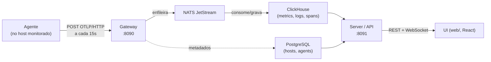

# Comunicação: push vs pull

**Resumo em uma frase:** o Revoada usa **PUSH** — o agente *envia*, o painel *nunca busca*.

Ao contrário do Prometheus e de ferramentas de *scraping*, o Revoada não abre
conexão para os hosts monitorados. Quem inicia toda comunicação é o agente, que roda
no próprio host, coleta localmente e faz um POST de saída para o gateway. O host
monitorado não precisa expor porta nem liberar firewall de entrada.

## Fluxo dos dados



O sentido das setas nunca se inverte no lado do host: **é sempre o agente saindo em
direção ao gateway**. O gateway, o NATS, o ClickHouse e o server ficam do lado do
painel, na infraestrutura da Revoada.

## Tabela comparativa

| Aspecto | **Push (Revoada)** | Pull (Prometheus/scraping) |
|---|---|---|
| Quem inicia a conexão | O **agente**, de dentro do host | O coletor central, de fora |
| Portas/firewall no host | Só saída (443/HTTP ao gateway); **nada de entrada** | Porta aberta de entrada em cada host + firewall liberado |
| Custo no host monitorado | Coleta local barata + 1 requisição a cada 15s | Cresce a cada *scrape* que o servidor central dispara |
| Resiliência a quedas do painel | WAL em disco no host; reenvia quando volta | *Scrapes* perdidos viram buracos no histórico |
| Service discovery | Não precisa; o host se anuncia ao gateway | Servidor central precisa descobrir e alcançar cada host |
| TLS | Na borda (Traefik + Let's Encrypt) | Cada alvo precisa de endpoint TLS próprio |

## Por que push "não sobrecarrega os servidores"

1. **Coleta local barata.** As métricas de host vêm do `gopsutil`, e a CPU é
   calculada pela **diferença entre a leitura atual e a anterior** de `/proc/stat`
   (`agent/internal/collect/cpu.go`) — cobre o intervalo inteiro entre coletas sem
   segurar o processador. A janela curta de 500ms só entra quando não há leitura
   anterior (primeiro ciclo do processo), e ela dorme em vez de trabalhar.
2. **Uma requisição a cada 15s.** O laço principal usa um `ticker` de
   `cfg.Interval()` (default 15s) e chama `collectAndSend`, que faz **um** POST
   OTLP por tick (`agent/cmd/revoada-agent/main.go`). O envio HTTP tem timeout
   de 10s (`agent/internal/otlpsend/send.go`).
3. **Backpressure via WAL.** Quando o gateway está fora, o agente grava os lotes em
   um buffer em disco (`agent/internal/buffer/buffer.go`, default **5000** arquivos).
   Ao estourar o teto, descarta o **mais antigo** (`enforceCap`) — nada trava e
   nada se acumula sem limite. A 15s por lote, 5000 arquivos cobrem cerca de **20h**
   de queda sem perder dados.
4. **Coletores caros são opt-in.** Logs de servidor (journald/docker/syslog/kmsg) e
   métricas por container só rodam se ligados explicitamente na config
   (`collect_journald`, `collect_docker_logs`, `collect_containers`, etc. —
   ver `agent/internal/config/config.go`; todos default `false`, exceto containers
   que exige socket presente). Quem não precisa, não paga.

O contraste é direto: no modelo **pull**, o coletor central precisa *alcançar* cada
host (porta aberta, firewall, service discovery) e a carga sobe no host **a cada
scrape do servidor**. No **push**, o host controla o próprio ritmo e só faz tráfego
de **saída**.

## Onde entra o pull: só as sondas de site

O único lugar onde o painel faz requisições **ativas** é a **sonda sintética de
site** (probe mode). É um modo **opt-in** (`probe: true` na config do agente,
`agent/internal/probe/probe.go`): a sonda faz requisições HTTP de fora para as URLs
configuradas em `probe_urls` e mede disponibilidade e latência do ponto de vista de
um usuário externo.

```yaml
# /etc/revoada/agent.yaml — modo sonda
probe: true
probe_location: "sao-paulo"
probe_urls:
  - "https://loja.exemplo.com/health"
  - "https://api.exemplo.com/status"
```

A sonda faz GET nas URLs e reporta o resultado ao gateway
(`POST /ingest/probe-result`). Dessas medições nascem as métricas `synthetic.http.*`
(por exemplo `synthetic.http.total_ms`, `synthetic.http.up`,
`synthetic.http.cert_days_left` — geradas em
`server/internal/sitecheck/checker.go`).

**Importante:** isso mede *sites/URLs*, não é *scraping do host monitorado*. Um host
comum **nunca** é "puxado" pelo painel — ele continua só empurrando suas próprias
métricas. A sonda é uma peça separada, voltada a disponibilidade externa.

## Autenticação e borda

O agente se autentica no gateway com o header **`X-Revoada-Key`** (a serverkey da
tabela `agents`, ver `agent/internal/otlpsend/send.go`). TLS é terminado na borda
(Traefik + Let's Encrypt, `revoada.exemplo.com.br` em produção).

## Ver também

- [`docs/nao-sobrecarga.md`](nao-sobrecarga.md) — aprofundamento sobre carga e capacidade (documento à parte).
- [`docs/runbook-dev.md`](runbook-dev.md) — como subir o stack e apontar um agente para um gateway de desenvolvimento.
- [`docs/MANUTENCAO.md`](MANUTENCAO.md) — guia de manutenção (arquitetura, onde mexer, glossário).
